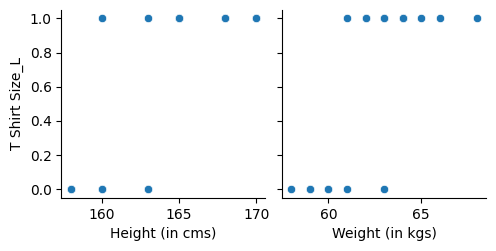

# 👕T-Shirt Size prediction using KNN
In this project we going to predict the T-Shirt size based on the height and weight. K-Nearest Neighbour model for the prediction.

```bash
import pandas as pd 
df = pd.read_csv("TShirt_size.csv")
df
```
## 🔢converting text data to numeric values
``` bash
df_label = df
df_label
```
## converting text into numeric 
```bash
df_label = pd.get_dummies(df_label,columns=['T Shirt Size'])
```
## 📈Data Visualisation
- Data representation
  


## 📊Standardizing the data
``` bash
scaler  = MinMaxScaler()
```
## 🧑‍🔧Traning and Testing Data
```bash
from sklearn.model_selection import train_test_split 
x_train , x_test , y_train , y_test = train_test_split(x,y,train_size= 0.7 , test_size=0.3 , random_state=100)
```
## 🤖Loading a Model
```bash

from sklearn.neighbors import KNeighborsClassifier
model = KNeighborsClassifier(n_neighbors=3)
```

<b><p>⭐ If you found this repository useful, consider giving it a star!</p>
<p>Happy Coding 🐍✨</p></b>

👤 Github  : [@droliasakshi12](https://github.com/droliasakshi12)<br>
📩 Email   : sakshidrolia12@gmail.com <br>
🔗 Linkdin : https://www.linkedin.com/in/sakshi-drolia12<br>
<h4>Credits</h4>
<b></b>Future Vision Computer Institute</b><BR>
🌐 Website : https://futurevisioncomputers.com/
<br>
<b><h5>Author</h5></b>
<b>Sakshi Drolia</b>

